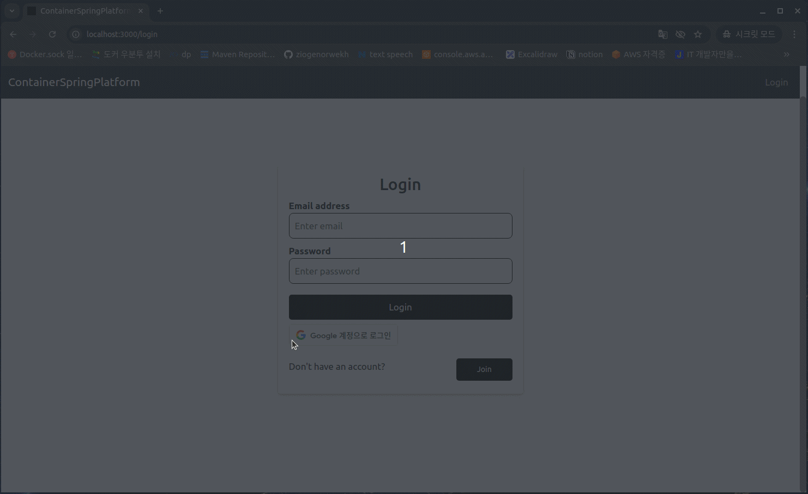
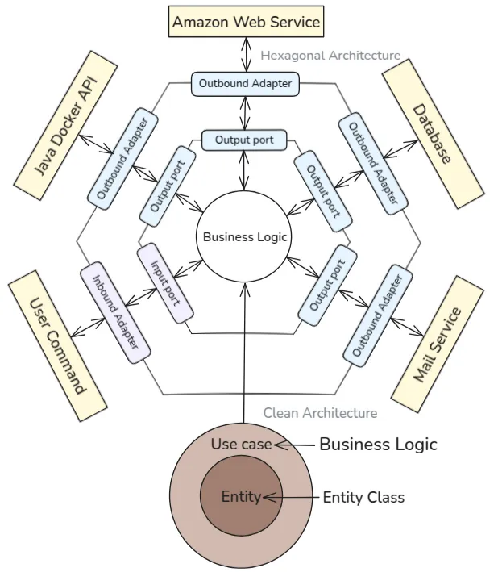
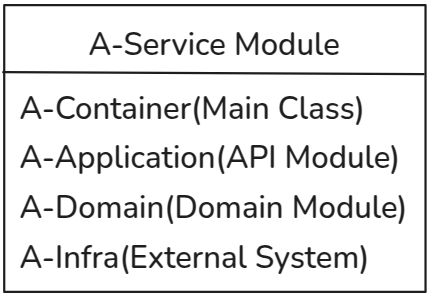
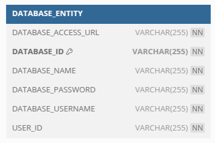
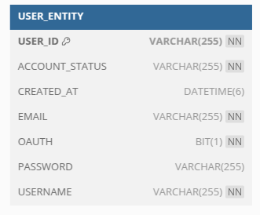
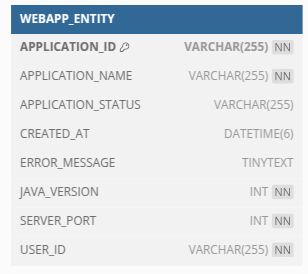
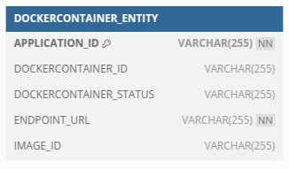
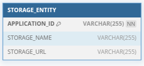

# 컨테이너 배포 시스템 프로젝트

### **프로젝트 관리자**

이서호

### **프로젝트 Github 주소**

[https://github.com/ziogenorwekh/docker-deploy-system](https://github.com/ziogenorwekh/docker-deploy-system)

### **프로젝트 기간**

2023.10 ~ 2024.01

# 🎯프로젝트 목표

---

<aside>
 게시판 프로젝트를 완성한 후, CI/CD 파이프라인을 구축하여 AWS에 자동 배포를 진행해 보았습니다. 코드가 변경될 때마다 자동으로 빌드되고, 배포까지 이루어지는 과정이 무척 신기하고 흥미로웠습니다. 한편으론 이 과정이 복잡하다고도 생각이 들었습니다. 저는 이런 경험을 바탕으로 자바 웹 애플리케이션을 최대한 간단한 방법으로 배포할 수 있도록, 자동화된 시스템을 만들고 싶었습니다.

최대한 단순하게 사용자가 포트 번호, 애플리케이션 이름, Java 버전만 입력하면 자동으로 배포되는 웹 애플리케이션을 구상하게 되었고, 이를 실현하기 위해 Docker 컨테이너를 활용한 배포 자동화 웹사이트를 개발하게 되었습니다.

</aside>

# 🏁프로젝트 결과

---

### **1. 구글 로그인 및 데이터베이스 생성**


### 2. **생성한 데이터베이스로 애플리케이션에 연결 후, 애플리케이션 실행**



# 📎기술 스택

---

### **📌 백엔드 기술 스택**

- **프레임워크**: Spring Boot
- **언어**: Java
- **데이터베이스**: MySQL(테스트 및 배포), H2Database(테스트)
- **아키텍처**: MSA(Microservices Architecture)
- **ORM(Object-Relational Mapping)**: JPA

### 📌 **개발 방식**

- **테스트 주도 개발(TDD)**
- **단위 테스트**: JUnit, Mockito
- **통합 테스트**: Spring Test

### **📌 인프라 & 배포**

- **컨테이너화**: Docker
- **구성 관리 & 자동화**: Ansible (로컬 실행)
- **클라우드 서비스(AWS)**
    - S3 (스토리지), EC2 (컴퓨팅), Route 53 (DNS 관리), RDS (데이터베이스 관리)

### **📌 프론트엔드 기술 스택**

- **프레임워크/라이브러리**: React
- **스타일링**: Bootstrap
- **HTTP 클라이언트**: Axios
- **인증**: Google Login

# 🧍요구사항

---

## 📒기능 명세서

<aside>
 [1] **사용자 접속 및 로그인**
└─> 프론트엔드에서 Google OAuth 등으로 인증 요청
└─> 유저 서비스에서 인증 처리 및 JWT 발급

[2] **사용자 애플리케이션 데이터 조회**
└─> 프론트엔드에서 사용자 애플리케이션 리스트 데이터 요청
└─> 거래 서비스 → 외부 거래소 API 연동 or 캐시/DB에서 조회
└─> 프론트에 최신 시세 정보 반환

[3] **AI 기반 시장 분석 결과 제공**
└─> 사용자가 거래 페이지 접근 시, 6시간마다 갱신된 AI 분석 결과 표시
└─> Market Data Collection & Analysis Service에서

- 외부 시세 수집

- OpenAI 호출

- 분석 결과 캐시 후 제공

[4] **자산 현황 및 거래 내역 확인**
└─> 프론트엔드에서 포트폴리오 조회 요청
└─> 포트폴리오 서비스에서 유저 잔고, 평가 손익 계산
└─> 유저 서비스에서 거래 내역 조합해 종합 응답

[5] **주문 기능 (매수/매도/예약주문)**
└─> 프론트에서 거래 요청 (주문하기/취소 등)
└─> 거래 서비스에서 주문 유효성 검사 및 처리
└─> 거래소 API 또는 시뮬레이션 엔진 연동
└─> 결과 기록 후 유저/포트폴리오 서비스에 반영

</aside>

## 📒API 명세서

**유저 API**

| Request | HTTP Method | URI | Authentication |
| --- | --- | --- | --- |
| 회원가입 | POST | /api/users | O(이메일 인증번호를 인증했을 경우 받는 토큰 값) |
| 회원 개인 조회 | GET | /api/users/{userId} | O |
| 회원 비밀번호 변경 | PUT | /api/users | O |
| 회원 탈퇴 | DELETE | /api/users/{userId} | O |
| 로그인 | POST | /api/auth/ogin | O |
| 이메일 인증번호 받기 | POST | /api/auth/mail-send | X |
| 이메일 인증번호 인증 | POST | /api/auth/verify-mail | X |
| 유저 정보 조회 | GET | /api/auth/user/info | O |
| 구글 유저 로그인 | POST | /api/auth/google | O(구글 인증 토큰 값) |

**웹애플리케이션관리 API**

| Request | HTTP Method | URI | Authentication |
| --- | --- | --- | --- |
| 유저 애플리케이션 정보 등록 | POST | /api/apps | O |
| 유저 애플리케이션 파일 업로드 | POST | /api/apps/{applicationId} | O |
| 도커 유저 컨테이너 시작 | PUT | /apps/starting/{applicationId} | O |
| 도커 유저 컨테이너 정지 | PUT | /apps/stopping/{applicationId} | O |
| 도커 유저 컨테이너 로그 조회 | GET | /apps/logs/{applicationId} | O |
| 유저 애플리케이션 단건 정보 조회 | GET | /api/apps/{applicationId} | O |
| 유저 애플리케이션 전체 조회 | GET | /api/apps/all | O |
| 유저 애플리케이션 삭제 | DELETE | /api/app/{applicationId} | O |
| 유저 애플리케이션 전체 삭제 | DELETE | /apps | O |

**데이터베이스 API**

| Request | HTTP Method | URI | Authentication |
| --- | --- | --- | --- |
| 데이터베이스 유저 및 데이터베이스 생성 | POST | /api/databases | O |
| 데이터베이스 정보 조회 | GET | /api/databases | O |
| 데이터베이스 유저 및 데이터베이스 삭제 | DELETE | /api/databases | O |

# 🛠️설계

---

## 📒아키텍쳐 설계

**헥사고날 아키텍처 && 클린 아키텍쳐**



**멀티 모듈**



<aside>
 핵심 비즈니스 로직은 중심에 위치하며, 포트와 어댑터를 통해 외부 시스템과 상호작용합니다. 유스 케이스와 엔티티는 클린 아키텍처의 구성 요소로, 비즈니스 로직의 구현에 사용합니다.

둘의 결합하면 3가지 장점을 가집니다.

- **독립성**: 비즈니스 로직은 외부 시스템에 의존하지 않으므로, 쉽게 변경하고 테스트할 수 있습니다.
- **모듈화**: 각 구성 요소가 독립적으로 동작하며, 변경이 필요한 경우에도 다른 부분에 영향을 최소화합니다.
- **확장성**: 새로운 기능이나 외부 시스템을 쉽게 추가할 수 있습니다.
</aside>

### 헥사고날 아키텍처와 클린 아키텍처를 사용한 마이크로 서비스 로직 흐름도

**예) 유저 정보 조회**


**마이크로 서비스, 멀티 모듈, 헥사고날 아키텍처를 채택한 이유**

- 기존 게시판 프로젝트는 단순한 구조 덕분에 유지보수가 용이했습니다. 그러나, 앞서 개발할 프로젝트는 여러 라이브러리를 사용함으로써 프로젝트 규모가 커질 것이라고 생각했습니다. 하나의 애플리케이션으로 운영하면 특정 기능을 수정하거나 확장할 때 전체 시스템이 꼬이는 등의 문제 가능성이 높아 유지보수가 어려워질 수 있습니다. 이 결과, 각 서비스를 독립적으로 관리 및 확장할 수 있도록 **마이크로서비스 아키텍처**를 채택하게 되었습니다.
- 게시판 프로젝트에서 사용했던 테스트 기반 아키텍처를 활용하기 위해 **멀티 모듈**을 도입했습니다. 외부 시스템과 연동되는 모듈과 비즈니스 로직을 담당하는 모듈을 분리함으로써, 각각 독립적으로 테스트할 수 있도록 설계를 계획했습니다. 이를 통해 테스트의 신뢰성과 유지보수성을 개선하고자 했습니다.
- 생각지 못했던 예외사항이나 프로젝트를 기획할 때 빠졌던 부분을 용이하게 수정하기 위해 **헥사고날 & 클린 아키텍처**를 채택했습니다.
- **의존성 역전 원칙**(DIP, Dependency Inversion Principle)을 적용하여 각 모듈의 역할과 책임을 명확히 분리하였습니다. 이를 통해 모듈 간의 결합도를 낮추고 유연하고 확장 가능한 아키텍처를 구축할 수 있었습니다. 특히, 테스트의 독립성을 확보하여 특정 모듈의 변경이 다른 모듈의 테스트에 영향을 미치는 것을 최소화하였고, 이를 바탕으로 안정적인 테스트 환경을 유지할 수 있었습니다.

---

## 📒도메인 설계


### **User 도메인 설계**

User 도메인은 사용자의 계정을 관리하는 엔티티입니다.

- UserId: 사용자 고유 번호 객체
- Email : 사용자의 이메일 주소값 객체
- Username: 사용자의 닉네임값 객체
- Password: 계정 비밀번호값 객체
- AccountStatus: 계정 상태 (활성/비활성)
- CreatedAt: 계정 생성 일시
- OAuth: 소셜 로그인 사용 여부(Google)

### Database 도메인 설계

Database 도메인은 사용자의 데이터베이스를 관리하는 엔티티입니다.

- UserId: 사용자 고유 번호 객체
- DatabaseUsername: 사용자 데이터베이스의 유저이름 값 객체
- DatabaseName: 사용자 데이터베이스 이름 값 객체
- DatababasePasswrod: 사용자 데이터베이스 패스워드 값 객체
- accessUrl: 사용자 데이터베이스 엔드포인트

### WebApp 도메인 설계

WebApp 도메인은 사용자의 웹애플리케이션을 관리하는 엔티티입니다.

- ApplicationId: 사용자 웹애플리케이션 고유 아이디 값 객체
- UserId: 사용자 고유 번호 객체
- ApplicationName: 사용자 웹애플리케이션 값 객체
- ServerPort: 사용자 웹애플리케이션 서버 포트 값 객체
- JavaVersion: 사용자 웹애플리케이션 버전 값 객체
- ApplicationStatus: 사용자 웹애플리케이션 상태 값 객체
- errorMessages: 사용자 웹애플리케이션 오류 메세지
- createdAt: 사용자 웹애플리케이션 생성일자

### DockerContainer 도메인 설계

DockerContainer 도메인은 사용자의 웹애플리케이션 컨테이너를 관리하는 엔티티입니다.

- ApplicationId: 사용자 웹애플리케이션 고유 아이디 값 객체
- DockerContainerId: 사용자 웹애플리케이션 컨테이너의 아이디 값 객체
- endPointUrl: 사용자 웹애플리케이션 엔드포인트
- DockerContainerStatus: 사용자 웹애플리케이션 컨테이너 상태 값 객체
- imageId: 사용자 웹애플리케이션 컨테이너 이미지 아이디

### Storage 도메인 설계

Storage 도메인은 사용자의 웹애플리케이션 파일을 관리하는 엔티티입니다.

- ApplicationId: 사용자 웹애플리케이션 고유 아이디 값 객체
- StorageUrl: 사용자 웹애플리케이션 파일 경로 값 객체
- StorageNmae: 사용자 웹애플리케이션 파일 이름 값 객체

## 📒스키마 설계

### 유저 서비스

- **User 스키마**
    - **기본 정보 설계**
        - USER_ID: 사용자의 고유 식별자로, UUID 형식의 문자열을 사용합니다. 기본 키로 설정되어 있어 중복되지 않도록 설정
        - USERNAME: 사용자의 이름으로, 중복되지 않도록 유니크 인덱스를 설정
        - EMAIL: 사용자의 이메일 주소로, 중복되지 않도록 유니크 인덱스를 설정
        - PASSWORD: 사용자 비밀번호를 암호화하여 저장
        - CREATED_AT: 사용자 생성일자 저장
    - **계정 활성화 코드를 저장하기 위한 컬럼 생성**
        - ACCOUNT_STATUS: ENABLED, DISABLED 같은 상태 값을 저장
    - **소셜 로그인 사용 여부 컬럼 생성**
        - OAUTH: 소셜 로그인 사용 여부(TURE, FALSE) 저장



### 데이터베이스 서비스

- **Database 스키마**
    - **기본 정보 설계**
        - DATABASE_ID: 데이터베이스의 고유 식별자로, UUID 형식의 문자열을 사용합니다. 기본 키로 설정되어 있어 중복되지 않도록 설정
        - USER_ID: 사용자의 고유 식별자로, 중복되지 않도록 유니크 인덱스를 설정, NOT NULL 제약 조건을 적용
        - DATABASE_NAME: 데이터베이스의 이름을 저장, NOT NULL 제약 조건을 적용
        - DATABASE_USERNAME: 데이터베이스 접속에 사용할 사용자 이름을 저장, NOT NULL 제약 조건을 적용
        - DATABASE_PASSWORD: 데이터베이스 접속에 사용할 비밀번호를 저장, NOT NULL 제약 조건을 적용
        - DATABASE_ACCESS_URL: 데이터베이스에 접속할 수 있는 URL을 저장, NOT NULL 제약 조건을 적용



### 배포 서비스

- **WebApp 스키마**
    - **기본 정보 설계**
        - APPLICATION_ID: 애플리케이션 주문의 고유 식별자로, UUID 형식의 문자열을 사용합니다. 기본 키로 설정
        - APPLICATION_NAME: 애플리케이션의 이름을 저장, 중복되지 않도록 유니크 인덱스를 설정
        - APPLICATION_STATUS: 애플리케이션의 상태(CREATED, CONTAINERIZING, COMPLETE, FAILED)를 저장
        - CREATED_AT: 애플리케이션의 생성일자 저장
        - ERROR_MESSAGE: 오류 메시지를 저장, 긴 문자열을 사용할 수 있도록 LONGTEXT를 설정
        - JAVA_VERSION: 자바 버전을 저장, NOT NULL 제약 조건을 적용
        - SERVER_PORT: 서버 포트를 저장, NOT NULL 제약 조건을 적용
        - USER_ID: 사용자 식별자로, 중복되지 않도록 유니크 인덱스를 설정




- **DockerContainer 스키마**
    - **기본 정보 설계**
        - APPLICATION_ID: 애플리케이션 주문 식별자로, 기본키로 설정
        - DOCKERCONTAINER_ID: 컨테이너의 고유 식별자로, 중복되지 않도록 유니크 인덱스를 설정
        - DOCKERCONTAINER_STATUS: 컨테이너 상태값(STARTED, STOPPED, INITIALIZED, ERROR)을 저장
        - ENDPOINT_URL: 컨테이너 접속 주소 저장
        - IMAGE_ID: 서버 포트를 저장




- **Storage 스키마**
    - **기본 정보 설계**
        - APPLICATION_ID: 애플리케이션 주문 식별자로, 기본키로 설정, NOT NULL 제약 조건을 적용
        - STORAGE_NAME: 파일 이름을 저장, 중복되지 않도록 유니크 인덱스를 설정
        - STORAGE_URL: 파일 URL을 저장



---

# 🚀배포 및 운영

## ⏳CI(Ansible Local PC)

### 📒목표


로컬 환경에서 Ansible을 이용하여 애플리케이션를 빌드한 후, 서버 환경으로 빌드가 완료된 파일을 옮기고 원격 명령을 통해 서버 환경에서 애플리케이션이 실행되도록 한다.

---

### Discovery-Service-Playbook.yml

```yaml
---
- name: Build and Deploy Microservices
  hosts: localhost
  tasks:
    - name: Build Discovery Service
      command: gradle :discovery-service:build
      args:
        chdir: "{{ playbook_dir }}"
    - name: Move Discovery Service JAR
      copy:
        src: "{{ playbook_dir }}/discovery-service/build/libs/discovery-service-1.0-SNAPSHOT.jar"
        dest: "{{ playbook_dir }}/artifacts/"
        mode: '0644'

- name: Transfer JARs to EC2
  hosts: ec2-instance
  tasks:
    - name: Send JAR files to EC2
      ansible.builtin.copy:
        src: "{{ playbook_dir }}/artifacts/discovery-service-1.0-SNAPSHOT.jar"
        dest: "/home/ec2-user/discovery-service-1.0-SNAPSHOT.jar"
        mode: '0644'

- name: Execute Discovery-Service Down on EC2
  hosts: ec2-instance
  become: true
  tasks:
    - name: Run Docker Compose Down with Image Removal
      block:
        - command: docker-compose -f network.yml -f discovery-compose.yml down
          args:
            chdir: /home/ec2-user/
      rescue:
        - debug:
            msg: "Ignoring errors while bringing down the discovery service"

- name: Stop and Remove Discovery Service with Images
  hosts: ec2-instance
  become: true
  tasks:
    - name: Run Docker Compose Down with Image Removal
      block:
        - command: docker-compose -f network.yml -f discovery-compose.yml down --rmi all
          args:
            chdir: /home/ec2-user/
      rescue:
        - debug:
            msg: "Ignoring errors while bringing down the discovery service"

- name: Execute Discovery-Service Up on EC2
  hosts: ec2-instance
  tasks:
    - name: Run Docker Compose for Discovery Service
      command: docker-compose -f network.yml -f discovery-compose.yml up -d
      args:
        chdir: /home/ec2-user/
```

**코드 설명**

Discovery-Service-Playbook.yml은 각 마이크로 서비스들을 관리하는 디스커버리 서비스를 배포 자동화하는 Ansible 플레이북입니다. 작업 순서는 다음과 같습니다.

- 로컬 환경에서 디스커버리 서비스 빌드
    - Gradle을 사용하여 JAR 파일 생성
    - 생성된 JAR 파일을 artifacts 디렉토리로 이동
- EC2 인스턴스로 파일 전송
    - 빌드된 JAR 파일을 EC2 서버의 지정된 경로로 전송
- 기존 디스커버리 서비스 중단
    - 실행 중인 Docker 컨테이너 중지
    - 관련 Docker 이미지 제거
- 새로운 디스커버리 서비스 시작
    - Docker Compose를 사용하여 새로운 컨테이너 실행
    - network.yml과 discovery-compose.yml 설정 파일 적용

---

### Micro-Service-Playbook.yml

```yaml
---
- name: Build and Deploy Microservices
  hosts: localhost
  tasks:
    - name: Build Gateway Service Container
      command: gradle clean build -x test
      args:
        chdir: "{{ playbook_dir }}/gateway-service"

    - name: Build Database Service Container
      command: gradle clean build -x test
      args:
        chdir: "{{ playbook_dir }}/database-service"

    - name: Build Deploy Service Container
      command: gradle clean build -x test
      args:
        chdir: "{{ playbook_dir }}/deploy-service"

    - name: Build User Service Container
      command: gradle clean build -x test
      args:
        chdir: "{{ playbook_dir }}/user-service"

    - name: Move Gateway Service JAR to Artifacts
      copy:
        src: "{{ playbook_dir }}/gateway-service/gateway-container/build/libs/gateway-container-1.0-SNAPSHOT.jar"
        dest: "{{ playbook_dir }}/artifacts/"
        mode: '0644'

    - name: Move Database Service JAR to Artifacts
      copy:
        src: "{{ playbook_dir }}/database-service/database-container/build/libs/database-container-1.0-SNAPSHOT.jar"
        dest: "{{ playbook_dir }}/artifacts/"
        mode: '0644'

    - name: Move Deploy Service JAR to Artifacts
      copy:
        src: "{{ playbook_dir }}/deploy-service/deploy-container/build/libs/deploy-container-1.0-SNAPSHOT.jar"
        dest: "{{ playbook_dir }}/artifacts/"
        mode: '0644'

    - name: Move User Service JAR to Artifacts
      copy:
        src: "{{ playbook_dir }}/user-service/user-container/build/libs/user-container-1.0-SNAPSHOT.jar"
        dest: "{{ playbook_dir }}/artifacts/"
        mode: '0644'

- name: Transfer JARs to EC2
  hosts: ec2-instance
  tasks:
    - name: Send JAR files to EC2
      ansible.builtin.copy:
        src: "{{ playbook_dir }}/artifacts/"
        dest: "/home/ec2-user/"
        mode: '0644'

- name: Execute Microservices Down on EC2
  hosts: ec2-instance
  become: true
  tasks:
    - name: Stop Microservices Containers
      block:
        - command: docker-compose -f network.yml -f microservices-compose.yml down
          args:
            chdir: /home/ec2-user/
      rescue:
        - debug:
            msg: "Ignoring errors while bringing down the microservices"

- name: Remove Microservices with Images
  hosts: ec2-instance
  become: true
  tasks:
    - name: Run Docker Compose Down with Image Removal
      block:
        - command: docker-compose -f network.yml -f microservices-compose.yml down --rmi all
          args:
            chdir: /home/ec2-user/
      rescue:
        - debug:
            msg: "Ignoring errors while removing microservices images"

- name: Execute Microservices Up on EC2
  hosts: ec2-instance
  tasks:
    - name: Run Docker Compose for Microservices
      command: docker-compose -f network.yml -f microservices-compose.yml up -d
      args:
        chdir: /home/ec2-user/
```

**코드 설명**

Micro-Service-Playbook.yml은 각 마이크로 서비스들을 배포 자동화하는 Ansible 플레이북입니다. 작업 순서는 다음과 같습니다.

- 로컬 환경에서 디스커버리 서비스 빌드
    - Gradle을 사용하여 JAR 파일 생성
    - 생성된 JAR 파일을 artifacts 디렉토리로 이동
- EC2 인스턴스로 파일 전송
    - 빌드된 JAR 파일을 EC2 서버의 지정된 경로로 전송
- 기존 마이크로 서비스 중단
    - 실행 중인 Docker 컨테이너 중지
    - 관련 Docker 이미지 제거
- 새로운 마이크로 서비스 시작
    - Docker Compose를 사용하여 새로운 컨테이너 실행
    - network.yml과 microservices-compose.yml 설정 파일 적용

---

### Front-Service-Playbook.yml

```yaml
---
- name: Build and Deploy React App to EC2
  hosts: localhost
  tasks:
    - name: Install npm dependencies
      command: npm install
      args:
        chdir: .

    - name: Build React app
      command: npm run build
      args:
        chdir: .

- name: Deploy React App to EC2
  hosts: ec2-instance
  become: yes
  vars:
    local_build_path: "./build"
    remote_app_path: "/home/ec2-user/"
    nginx_config_path: "./nginx.conf"

  tasks:
    - name: Transfer built React app to EC2
      ansible.builtin.copy:
        src: "{{ local_build_path }}/"
        dest: "{{ remote_app_path }}/build/"
        owner: ec2-user
        group: ec2-user
        mode: "0755"

    - name: Transfer Nginx config to EC2
      ansible.builtin.copy:
        src: "{{ nginx_config_path }}"
        dest: "{{ remote_app_path }}/nginx.conf"
        owner: ec2-user
        group: ec2-user
        mode: "0644"

- name: Execute front-Service Down on EC2
  hosts: ec2-instance
  become: true
  tasks:
    - name: Run Docker Compose Down with Image Removal
      block:
        - command: docker-compose -f network.yml -f front-compose.yml down
          args:
            chdir: /home/ec2-user/
      rescue:
        - debug:
            msg: "Ignoring errors while bringing down the front service"

- name: Stop and Remove front Service with Images
  hosts: ec2-instance
  become: true
  tasks:
    - name: Run Docker Compose Down with Image Removal
      block:
        - command: docker-compose -f network.yml -f front-compose.yml down --rmi all
          args:
            chdir: /home/ec2-user/
      rescue:
        - debug:
            msg: "Ignoring errors while bringing down the front service"

- name: Execute front-Service Up on EC2
  hosts: ec2-instance
  tasks:
    - name: Run Docker Compose for front Service
      command: docker-compose -f network.yml -f front-compose.yml up -d
      args:
        chdir: /home/ec2-user/
```

**코드 설명**

Front-Service-Playbook.yml은 프론트엔드를 배포 자동화하는 Ansible 플레이북입니다. 작업 순서는 다음과 같습니다.

- 로컬 환경에서 프론트엔드 서비스 빌드
    - npm 의존성을 다운로드
    - npm 빌드
- EC2 인스턴스로 파일 전송
    - 빌드된 폴더, nginx.conf를 EC2 서버의 지정된 경로로 전송
- 기존 프론트엔드 서비스 중단
    - 실행 중인 Docker 컨테이너 중지
    - 관련 Docker 이미지 제거
- 새로운 프론트엔드 서비스 시작
    - Docker Compose를 사용하여 새로운 컨테이너 실행
    - network.yml과 front-compose.yml 설정 파일 적용

---

## ⏳CD(Docker-Compose EC2 Instance)

### 서비스별 Dockerfile

```docker
FROM openjdk:17-slim

WORKDIR /app

COPY micro-service-1.0-SNAPSHOT.jar app.jar

ENV SPRING_PROFILES_ACTIVE=prod

ENTRYPOINT ["java", "-Dspring.profiles.active=prod", "-jar", "/app/app.jar"]

EXPOSE 서비스별 포트번호

```

**코드 설명**

각 서비스별로 도커 이미지를 만드는 도커파일입니다.

---

### Discovery-compose.yml

```yaml
version: '3.9'

services:
  discovery-service:
    build:
      context: .
      dockerfile: discoveryDockerfile
    container_name: discovery-service
    ports:
      - "8761:8761"
    networks:
      - msa-network

networks:
  msa-network:
    driver: bridge
```

**코드 설명**

마이크로 서비스들을 관리하는 디스커버리 서비스의 docker-compose 파일입니다. 같은 디렉터리에 있는 discoveryDockerfile를 이미지화하고 8761포트를 사용하고,

도커 네트워크인 `msa-network`를 사용하여 컨테이너를 다른 마이크로서비스들과 같은 네트워크 상에서 통신할 수 있도록 구성합니다.

---

### MicroServices-compose.yml

```yaml
version: '3.9'

services:
  gateway-service:
    build:
      context: .
      dockerfile: gatewayDockerfile
    container_name: gateway-service
    ports:
      - "8600:8600"
    networks:
      - msa-network

  user-service:
    build:
      context: .
      dockerfile: userDockerfile
    container_name: user-service
    ports:
      - "9010:9010"
    networks:
      - msa-network

  database-service:
    build:
      context: .
      dockerfile: databaseDockerfile
    container_name: database-service
    ports:
      - "9020:9020"
    networks:
      - msa-network

  deploy-service:
    build:
      context: .
      dockerfile: deployDockerfile
    container_name: deploy-service
    ports:
      - "9030:9030"
    networks:
      - msa-network
    environment:
      - JAVA_OPTS=-Xms1024m -Xmx2048m

networks:
  msa-network:
    driver: bridge

```

**코드 설명**

마이크로 서비스들을 관리하는 docker-compose 파일입니다. 같은 디렉터리에 있는 Dockerfile를 이미지화하고,

도커 네트워크인 `msa-network`를 사용하여 컨테이너를 다른 마이크로서비스들과 같은 네트워크 상에서 통신할 수 있도록 구성합니다.

---

### Front-compose.yml

```yaml
version: '3.9'

services:
  front:
    image: nginx:alpine
    container_name: front
    ports:
      - "80:80"
    networks:
      - msa-network
    volumes:
      - /home/ec2-user/build:/usr/share/nginx/html
      - /home/ec2-user/nginx.conf:/etc/nginx/nginx.conf

networks:
  msa-network:
    driver: bridge
```

**코드 설명**

프론트엔드를 관리하는 docker-compose 파일입니다. 같은 디렉터리에 있는 `nginx.conf`를 Nginx 설정 파일로 사용하며, `/home/ec2-user/build` 디렉터리에 위치한 빌드된 정적 파일들을 Nginx의 기본 루트 디렉터리(`/usr/share/nginx/html`)에 마운트하여 서비스합니다. 또한, `msa-network`라는 도커 네트워크를 사용하여 다른 마이크로서비스들과 동일한 네트워크 상에서 통신할 수 있도록 설정되어 있습니다.

---

# 🚧 트러블슈팅

1. User Service를 개발하는 과정에서 **Google API Client** 의존성에 포함된 `Guava` 버전 충돌로 인해 실행이 불가능한 문제가 발생했습니다. 문제를 조사하는 과정에서 **Caffeine Cache** 또한 `Guava`를 사용하고 있음을 알게 되었습니다. 이를 바탕으로 **서로 다른 의존성이 내부적으로 동일한 라이브러리를 사용하지만, 요구하는 버전이 다를 경우** 충돌이 발생하여 문제를 일으킬 수 있습니다. 이를 해결하기 위해서 **Container 모듈에서 `Guava`의 버전을 일괄적으로 관리하도록 설정**하였고, 이 결과 **Google API Client와 Caffeine Cache 간의 버전 충돌을 해결**할 수 있었습니다.

   이 경험은 **멀티 모듈 환경에서 의존성의 버전 관리가 중요함을 깨닫게 되었으며, `dependencyManagement`**를 활용하여 **일관된 버전을 유지하는 것**이 필수적임을 알게되었습니다.

2. 기존에는 도커 컨테이너 로그를 **비동기 방식으로** 가져오면서 API 응답에서 **로그 데이터가 완전히 수집되지 않는 문제**가 발생했습니다. 이를 해결하기 위해 Docker Java API의 **`LogContainerResultCallback`을 활용하여 동기적으로 로그를 수집하는 방식**으로 개선하였습니다.
3. 사용자가 직접 데이터베이스 이름을 설정할 경우, **예약어 충돌, 네이밍 규칙 위반 등의 문제 발생 가능성**이 존재했습니다. 이를 방지하기 위해, **사용자 입력값을 기반으로 랜덤한 문자열을 조합하여 데이터베이스 이름을 생성하는 `DatabaseName` 값 객체를 도입**하였습니다. **사용자 입력값에서 공백 제거** 후, **랜덤한 6자리 영문 문자열을 추가**하여 고유한 데이터베이스 이름을 생성하는 등, **충돌 및 보안 문제를 방지**할 수 있도록 개선하였습니다.